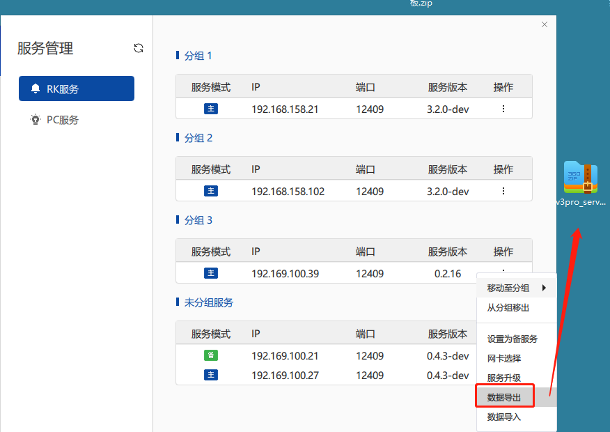

# RK Sender Box User Manual

## 1. Network Communication Configuration
- The initial IP for the sender box is `202.11.11.1`. As shown below, set the first two digits of the computer's IP address to the same network segment as the sender box IP, with a subnet mask of `255.255.0.0` (The sender box IP can be manually changed through the front LCD screen and the adjacent knob, but note that the first two digits of the IP address cannot be `202.34`).

## 2. Install Client
- Double-click to run `v3pro_arm_2.6.6_windows_x64.exe`, and proceed to the end.

## 3. Service Management
- Run the client, click on "Service Management" in the settings to enter the interface.

### 3.1 Search Services
- Click the refresh button on the interface to search for services as shown below.

### 3.2 RK Service Groups
- Click on settings to group services as shown below.

#### 3.2.1 RK Service Primary/Backup
- For multiple services in the same group, set one as the primary service and the rest as backup services by clicking on "Set as Primary (Backup)".

### 3.3 Data Import/Export
- Export display and configuration data for this service as shown below.

### 3.4 Service Upgrade
- Upgrade services in the service management interface. Only v3pro_server service can be upgraded, multiple services can be upgraded simultaneously.

Upgrade services in the device debugging interface. v3pro_arm can upgrade all services, and other services can also be upgraded individually.

### 3.5 Add Layout Configuration Service
- After setting primary and backup services in the service management interface, when working on layouts for multiple services (multiple sender boxes) in a group, set the services as shown below.

### 3.6 Brightness and Color
- Click on the menu item "Brightness and Color" in the left toolbar. Brightness and color control include brightness adjustment, gamma adjustment, color temperature adjustment, and color gamut adjustment.

#### 3.6.1 Brightness Adjustment
- Manual adjustment method: Click on "Manual" under "Select Adjustment Method" to enter manual adjustment mode. Change brightness value by clicking "+", "-", or dragging the slider.

- Automatic adjustment method: Click on "Auto" under "Select Adjustment Method" to enter automatic adjustment mode. Automatic mode includes time table adjustment, ambient brightness adjustment, and hardware adjustment.

- Time table adjustment allows scheduled automatic brightness adjustment. Users can create a new time table to flexibly set different brightness schedules.

- In each time table item, set the start and end date, repeat cycle, start and end time, and specified brightness. Click "Save" after successful settings.

#### 3.6.2 Gamma Adjustment
- In the brightness and color control page, click on gamma adjustment to enter the gamma adjustment page. Gamma adjustment includes manual adjustment and time table adjustment.

##### Manual adjustment method: 
- Click on "Manual" under "Select Adjustment Method" to enter manual adjustment mode as shown below. Change gamma value by clicking "+", "-", or dragging the slider. The adjustable gamma range is 1.0-4.0.

##### Time table adjustment method:
- Click on "Time Table" under "Select Adjustment Method" to enter time table adjustment mode as shown below.

### 3.7 Screen Control
- In the screen control page, click on basic settings to enter the basic settings interface.

- Screen settings:
  - Click "Normal" to restore the display to the normal input signal.
  - Click "Black Screen" to display a black screen.
  - Click "Lock Screen" to freeze the current frame.
  
- Signal source switching:
  - Click "Auto" to display the current connected signal source on the large screen.
  - Click "Signal Source-1" to display the signal from source-1 on the large screen.
  - Click "Signal Source-2" to display the signal from source-2 on the large screen.
  
- Visual mode: Independently switch between 2D mode and 3D mode. For 3D mode, connect the corresponding sender box and scanning board. Adjust 3D phase setting by clicking "+", "-", or dragging the slider. By default, select "2D mode".

- HDR setting: Control the sender box's HDR function. Some sender boxes support this function.

- EDID setting: Corresponding resolution, custom resolution.

#### 3.7.1 Advanced Settings
- In the screen control page, click on advanced settings to enter the advanced settings interface.

- No Signal Display: When there is no signal (sender box is not connected to an input display signal or the signal source is faulty), you can set the large screen to keep the last frame, display a black screen, standby screen, or demo screen.

- Scaling Processing: Scaling modes support horizontal and vertical directions separately. There are 6 modes: no processing, magnify 1.25 times, magnify 1.5 times, magnify 2 times, shrink 0.5 times, and automatic scaling. By default, select "No Processing" mode, which means no scaling.

### 3.8 Power Control
- Select "Power Control" to enter the power control interface. Power control methods include manual control and time table control. Switch between "Manual" and "Time Table" to toggle the power control method. Before using power control, associate with PLC peripherals.

#### (1) Manual Method
- As shown below, you can control individual power channels by clicking on the status of a single power channel to independently control a specific power channel. You can also control all power channels by clicking on the "Up/Down" button to control all power channels at once.

#### (2) Time Table Method
- Set power on/off control according to a custom schedule. Click "New" to create a power control schedule.

- Customize the schedule details by clicking "Edit". Each schedule can have multiple items to set on/off power control. Each schedule item can set the start and end date range, repeat cycle, start and end time, and specify power on/off time. Click "Delete" to remove unused schedule items.

- "Activate" and "Delete" schedules. There can be multiple power control schedules associated with the display, but only one is effective. Users can choose the desired schedule by activating it.

### 3.9 External Device Configuration
- All sub-devices under the receiver box are considered external devices, including PLC, smoke sensors, brightness sensors, etc. Click the **Manage Devices** button; this interface allows you to add or remove total external devices. When only external devices are associated, and the receiver box is not associated, the status monitoring interface displays the running status of external devices but does not show the operational status of the receiver box.

- After configuring the total external devices, close the external device configuration interface and return to the main external device configuration interface. At this point, a list of added external devices will appear under the available devices.

